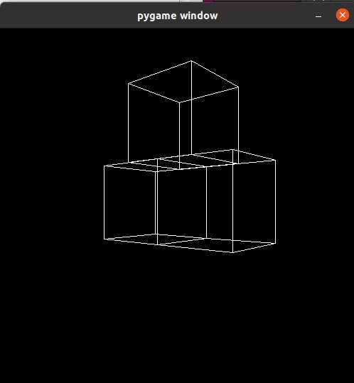

# Volume
A Raw 3D engine made in python using pygame
## How to Use
* Install python 3 and the pygame module
* Simply run VolumeV1.py or VolumeV2.py using python 3
## What I learned making it
* A lot about geometry
* A lot about how things are rendered in 3D
* The basic of object oriented programming and code architecture
* A lot of python

